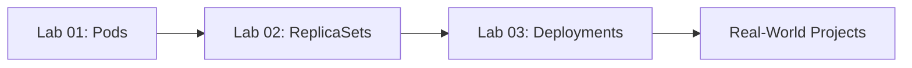

# 🚀 Kubernetes Labs - Collaborative Learning

[](CONTRIBUTING.md)
[](LICENSE)

A hands-on, collaborative repository for learning Kubernetes fundamentals through practical labs. Perfect for DevOps Engineers and developers looking to master Pods, ReplicaSets, and Deployments.

## 📚 What You'll Learn

This repository contains three progressive labs that take you from Kubernetes basics to production-ready deployments:

1. **Lab 01: Creating Your First Pod** - Understanding Pods with imperative and declarative approaches
2. **Lab 02: ReplicaSets** - Keeping your Pods alive with auto-healing
3. **Lab 03: Deployments** - Production-grade app management with rolling updates and rollbacks

## 🎯 Who Is This For?

- DevOps Engineers learning Kubernetes
- Developers transitioning to container orchestration
- Anyone wanting hands-on practice with K8s core concepts
- Teams looking for collaborative learning exercises

## 🛠️ Prerequisites

Before starting these labs, ensure you have:

- **Kubernetes cluster** (Minikube, Kind, Docker Desktop, or cloud-based)
- **kubectl** installed and configured
- Basic understanding of containers and Docker
- Terminal/PowerShell access

### Quick Setup Verification
```bash
# Check kubectl is installed
kubectl version --client

# Verify cluster access
kubectl cluster-info

# Check if you can list pods
kubectl get pods
```

## 📖 Lab Structure

Each lab folder contains:
- `README.md` - Step-by-step instructions
- `solutions/` - YAML files and completed examples
- `challenges/` - Optional exercises to test your knowledge

### Lab 01: Creating Your First Pod
**Duration:** 30 minutes  
**Difficulty:** Beginner

Learn the fundamentals:
- What is a Pod?
- Imperative vs Declarative approaches
- Basic kubectl commands
- Debugging and inspecting Pods

[Start Lab 01 →](labs/01-pods/README.md)

### Lab 02: ReplicaSets – Keeping Your Pods Alive
**Duration:** 45 minutes  
**Difficulty:** Beginner-Intermediate

Master resilience:
- Understanding ReplicaSets
- Auto-healing in action
- Manual scaling
- Label selectors and Pod management

[Start Lab 02 →](labs/02-replicasets/README.md)

### Lab 03: Deployments – Production-Ready Apps
**Duration:** 60 minutes  
**Difficulty:** Intermediate

Production patterns:
- Deployment strategies (RollingUpdate vs Recreate)
- Zero-downtime updates
- Rollback capabilities
- Scaling best practices

[Start Lab 03 →](labs/03-deployments/README.md)

## 🤝 Contributing

We welcome contributions! Whether you're:
- Fixing typos
- Adding clarifications
- Creating new challenges
- Improving documentation
- Sharing your solutions

Please read our [CONTRIBUTING.md](CONTRIBUTING.md) guide.

### Quick Contribution Guide

1. Fork this repository
2. Create a branch: `git checkout -b feature/your-improvement`
3. Make your changes
4. Test your changes (if applicable)
5. Commit: `git commit -m "Add: your improvement description"`
6. Push: `git push origin feature/your-improvement`
7. Open a Pull Request

## 💡 How to Use This Repository

### For Learners:
1. Fork this repo to your GitHub account
2. Clone it locally: `git clone https://github.com/YOUR-USERNAME/kubernetes-labs-collaborative.git`
3. Complete labs in order (01 → 02 → 03)
4. Create your own branches to experiment
5. Share your solutions via Pull Requests!

### For Instructors:
- Use this as a workshop curriculum
- Assign labs as homework
- Encourage students to contribute improvements
- Create issues for discussion topics

## 🏆 Learning Path


## 📝 Best Practices for Learners

1. **Don't rush** - Understanding is more important than speed
2. **Experiment** - Break things, then fix them
3. **Document** - Add comments to your YAML files
4. **Share** - Create PRs with your solutions and learnings
5. **Help others** - Review other people's PRs and provide feedback

## 🐛 Found an Issue?

If you find:
- Errors in lab instructions
- Broken commands
- Unclear explanations
- Missing prerequisites

Please [open an issue](../../issues/new/choose) with details!

## 📚 Additional Resources

- [Official Kubernetes Docs](https://kubernetes.io/docs/)
- [Kubectl Cheat Sheet](https://kubernetes.io/docs/reference/kubectl/cheatsheet/)
- [Kubernetes The Hard Way](https://github.com/kelseyhightower/kubernetes-the-hard-way)

## 📜 License

This project is licensed under the MIT License - see [LICENSE](LICENSE) file for details.

## 🙏 Acknowledgments

- Original lab content inspired by [pravinmishraaws/Kubernetes-For-DevOps-Engineers](https://github.com/pravinmishraaws/Kubernetes-For-DevOps-Engineers)
- All contributors who help improve these labs
- The Kubernetes community

## 📬 Contact & Community

- **Issues:** Use GitHub Issues for questions and discussions
- **Discussions:** Share your experience in GitHub Discussions
- **Maintainer:** [@Dudubynatur3](https://github.com/Dudubynatur3)

---

**⭐ Star this repo if you find it helpful!**

**🔀 Fork it to start your learning journey!**

**🤝 Contribute to help others learn!**
